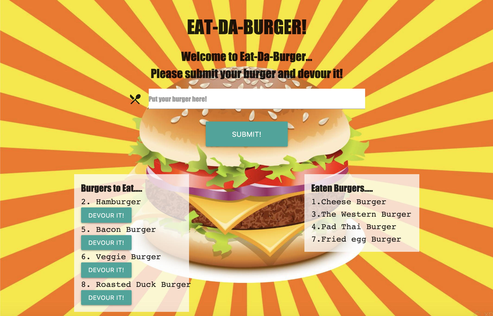
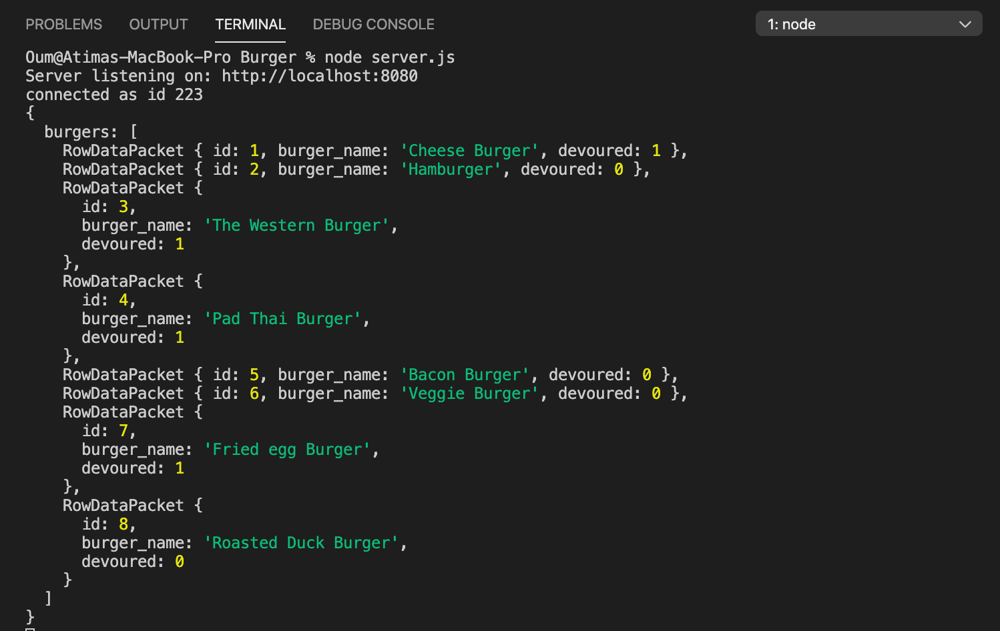
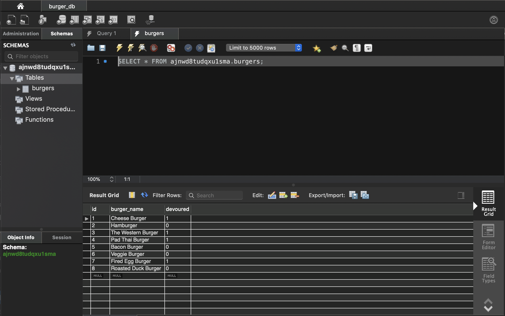

 

# Burgers (Node Express Handlebars)

In this assignment, I created a burger logger with MySQL, Node, Express, Handlebars and  ORM. I  use Node and MySQL to query and route data in the app, and Handlebars to generate the HTML.

## Table of Contents
* [Instructions](#instructions)
* [Installation](#installation)
* [Usage](#usage)
* [Tests](#tests)

## Instructions
* Eat-Da-Burger! is a restaurant app that lets users input the names of burgers they'd like to eat.

* Whenever a user submits a burger's name, the app will display the burger on the left side of the page -- waiting to be devoured.

* Each burger in the waiting area also has a `Devour it!` button. When the user clicks it, the burger will move to the right side of the page.

* This app will store every burger in a database, whether devoured or not.

#### Directory structure
All the files and directories look like the following structure:

```
.
├── config
│   ├── connection.js
│   └── orm.js
│ 
├── controllers
│   └── burgers_controller.js
│
├── db
│   ├── schema.sql
│   └── seeds.sql
│
├── models
│   └── burger.js
│ 
├── node_modules
│ 
├── package.json
│
├── public
│   └── assets
│       ├── css
│       │   └── burger_style.css
│       └── img
│           └── burger.png
│   
│
├── server.js
│
└── views
    ├── index.handlebars
    └── layouts
        └── main.handlebars
```

## Installations

1. Clone a GitHub repo `Burger` to your computer.

2. Install the Handlebars npm package: `npm install express-handlebars`.

3. Install MySQL npm package: `npm install mysql`.

4. Install the Express npm package: `npm install express`.


## Usage
Type `npm start` or `node server.js` in console then the application will prompt the `http://localhost:8080/`.


## Link

#### [Click here for deployed link!](https://burger-burger-baby.herokuapp.com/)

## Tests



